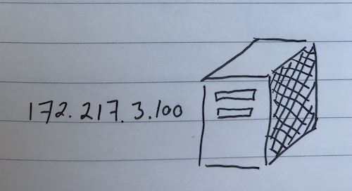

# DNS

DNS stands for "Domain Name System". It's the phonebook for the internet.

Imagine you want to call your friend. If you memorized their phone number, you can dial it to reach them.

But if you have a lot of friends, it can be difficult to memorize everyone's phone number.

A phonebook lets you get the phone number for your friend; all you need to know is their name. Memorizing a name is a lot easier than memorizing a phone number.

DNS is similar. You want to visit a website served by a server. If you memorized the server's IP address, you can reach them directly.

> Try this out yourself.
> Mac users can run `nslookup www.google.com`. You should get an IP address in your result. Copy and paste that IP address into your browser. That should bring you to www.google.com.
> 

DNS lets you get the IP address for the server; all you need to know is their domain name.

When you enter a domain name into your browser, it looks up the IP address.

First, it checks if it already knows it. Someone else might have looked up the address before.

Then, your browser makes requests to DNS name servers. Name servers store DNS records for a domain. They receive queries for names, and return IP addresses.

Name servers are organized into a domain hierarchy. Each domain has its own name server.

For example, let's imagine you're visiting `www.wikipedia.org`. We ask the `root` name server. This is the top of the hierarchy and knows about all domains.

The `root` name server might not have the DNS record for `www.wikipedia.org`, but redirects you to the `.org` name server. We ask the `.org` name server. It might have the DNS record for it, or it might direct you to another name server that has it. Eventually, you'll get back the IP address for `www.wikipedia.org`.

There are name servers all around the world. If you were in Japan, you could get a different IP address for [www.google.com](http://www.google.com) than someone in San Francisco. This allows you to access servers that are physically closer to you, so you can have a faster experience.
