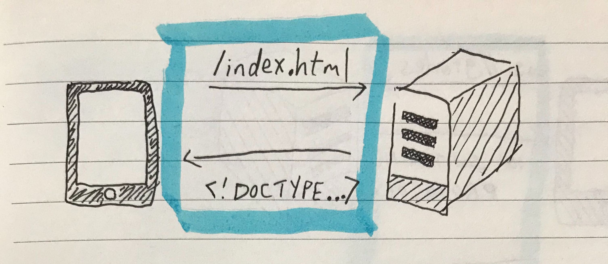

# WebSockets

WebSockets are a way for 2 computers to talk with each other. To see why WebSockets are useful, let's first look at HTTP requests.

HTTP requests are a common way for computers to talk with each other. One computer, which we'll call the *client*, **requests** information from the other computer, which we'll call the *server*. The server **responds** back to the client with information. We call this the **request/response cycle**.

Notice how the server can only respond to requests from the client. If the server has something interesting to tell the client, it has to wait for the client to ask them about it. Consequently, if the client wants to know when the server has an interesting update, the client needs to keep making requests to the server. We call this polling.

Polling is a work-around for a fundamental problem with HTTP requests; servers can't send information to the client unless the client requests it. WebSockets solve this.

WebSockets creates a permanent connection between the client and server. The client can send messages to the server through this connection. More importantly, the server can send messages to the client whenever it wants. It doesn't even need a request.

What are some use cases where you want to use WebSockets rather than HTTP requests?

* Does your application have messages that are frequently sent?
> ie: A stock market application may need to send multiple events per second for stock prices.

* Does your application need to maintain a connection for a long time?
> ie: A chat application needs to stay connected to send and receive messages. 

